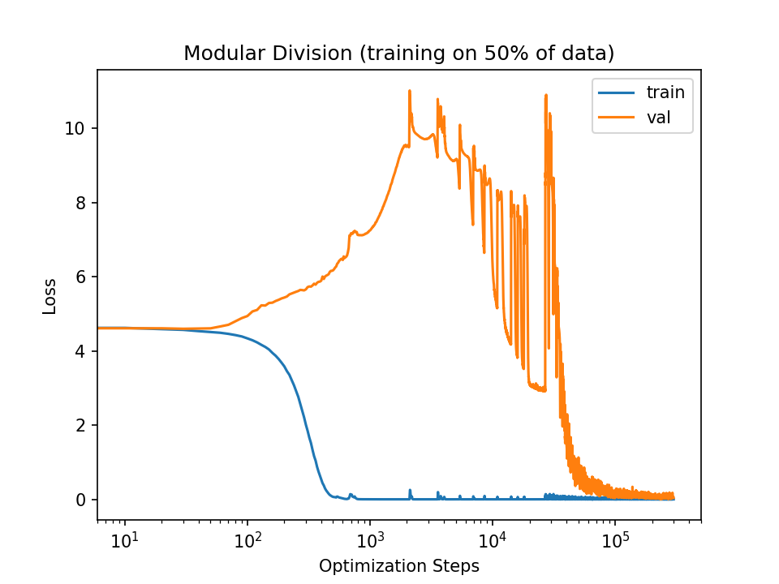
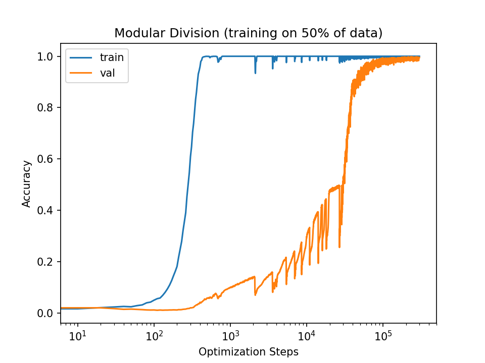
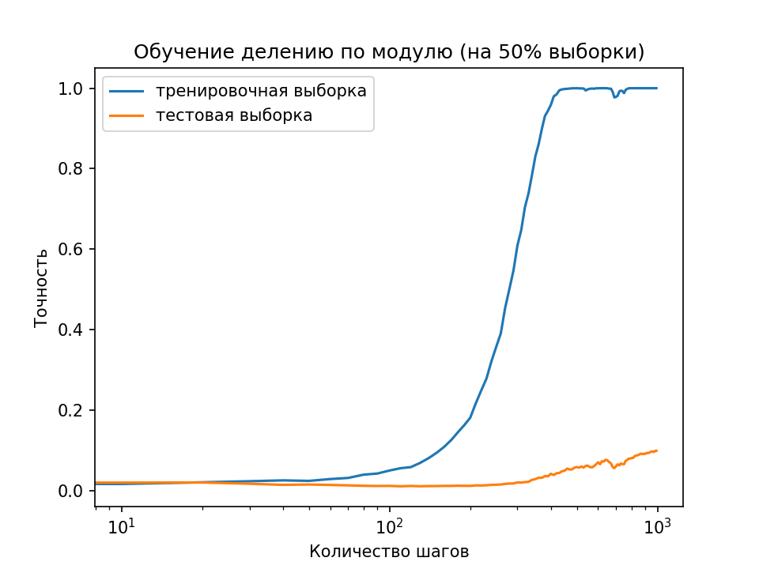
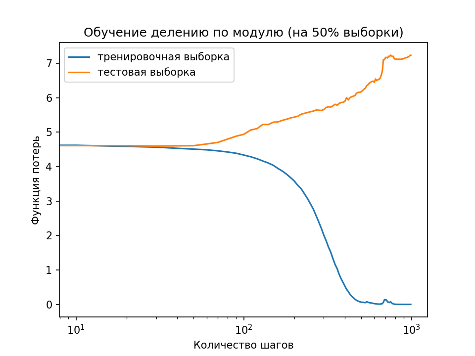
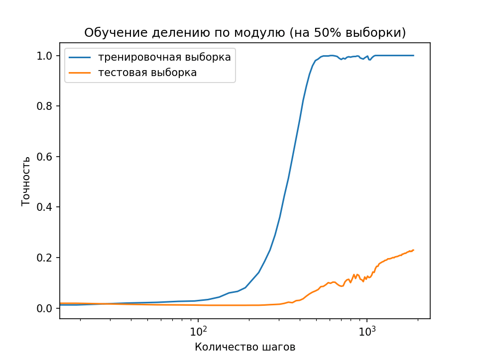
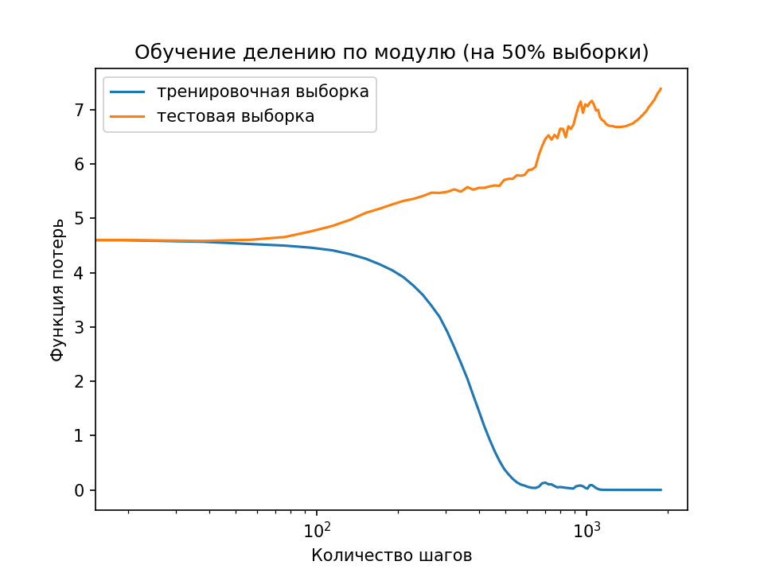
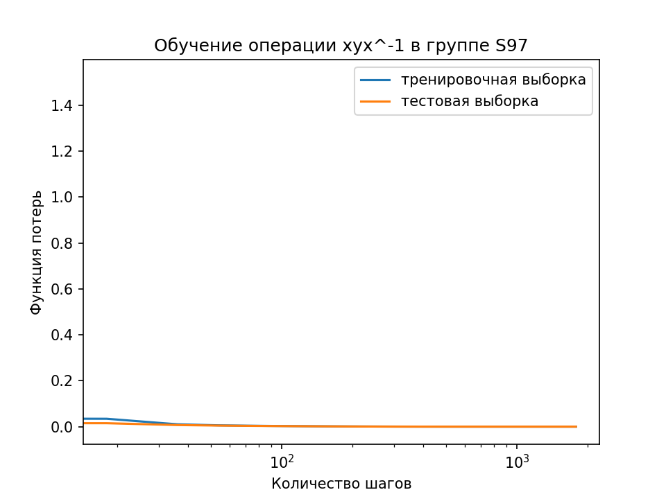

# Введение в МО. Двойной спуск. Интуитивное обучение
Реализация феномена двойного спуска в глубоком обучении по материалам статьи Grokking: Generalization beyond overfitting (см. ниже точное указание).
К реализации прилагается обзорная статья (очерк <ins>Intuitive Learning, Paper.pdf</ins>), где исследуется связь переобучения с нахождением закономерностей в данных. 
Затрагиваюся следующие темы:
- Связь нормы, гладкости, регуляризации и простоты решения. Принцип "бритвы Оккама".
- flat minima, generalization gap
- epoch-wise DD (двойной спуск по эпохам)

Визуализация двойного спуска (30 000 итераций, batchsize=512, budget=3e5):
| Функция потерь            | Точность          |
|------------------------|------------------------|
|  |  |

## Ключевая концепция
Объяснение формы кривой двойного спуска, основываясь на epoch-wise модели и алгоритме 𝑆𝐺𝐷. Согласно ей можно выделить три этапа:
1. Начальное обобщение (simple generalisation)
Модель изучает простые закономерности. Test Error ↓
2. Запоминание (memorizing)
Если шума нет, то модель начинает концентрироваться на отдельных примерах, запоминая их и пытаясь встроить к уже изученным правилам. Если данные к тому же зашумлены,
то неправильные примеры также запоминаются. Train Error ↓; Test Error ↑
4. Объединение (consolidation)
Модель объединяет успешные результаты этапов (1) и (2), путем регуляризации и упрощения функции. В результате Test Error ↓, двойной спуск завершён.

## Запуск
```python
train.py # С настройкой параметров модели
```
## Результаты

(1) Операция $\frac{x}{y} \ mod \ p \ $, $(x + y) \ mod \ p \$, $x \cdot y \ mod \ p \$

(2) Операции с перестановками в группе $S_{97}$: $xyx^{-1}, \ x \cdot y$

| Номер опыта | Batch size | Budget | Вид операции
|:-----------:|:-----------:|:-----------:|:-----------:|
| 1   |         512  |        3e5 | (1) | 
| 2   |         256  |         3e4    | (1) |
| 3   |         256  |         3e4 | (2) |

### Опыт 1
| Точность | Функция потерь |
|----------|----------|
|  |  |

### Опыт 2

| Точность | Функция потерь |
|----------|----------|
|  |  |

### Опыт 3



## Цитирование оригинальной работы
```
@inproceedings{power2021grokking,
  title={Grokking: Generalization beyond overfitting on small algorithmic datasets},
  author={Power, Alethea and Burda, Yuri and Edwards, Harri and Babuschkin, Igor and Misra, Vedant},
  booktitle={ICLR MATH-AI Workshop},
  year={2021}
}
```
